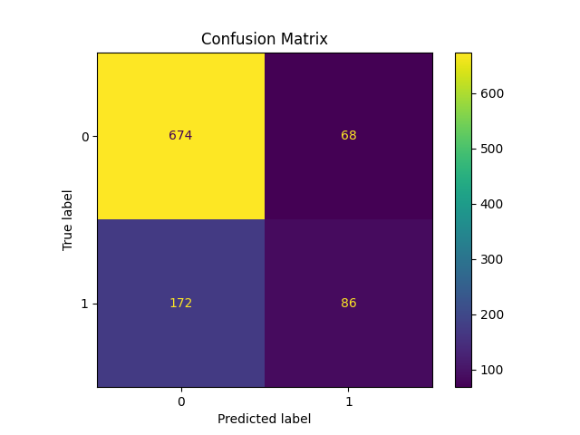
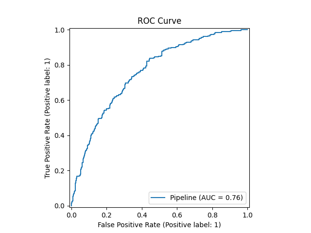
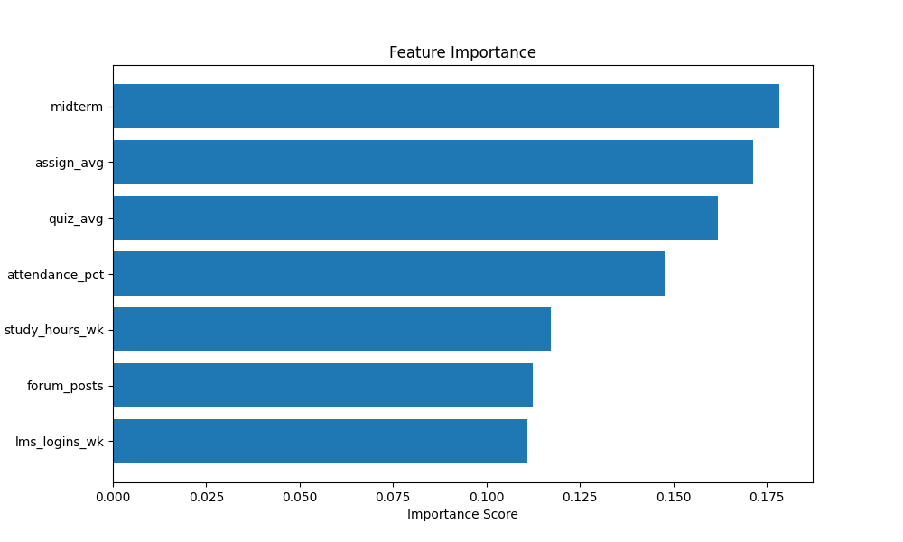
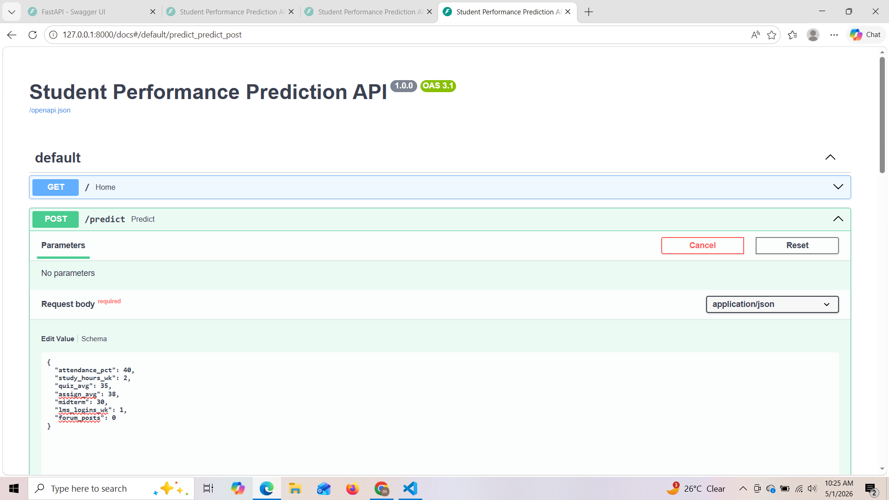
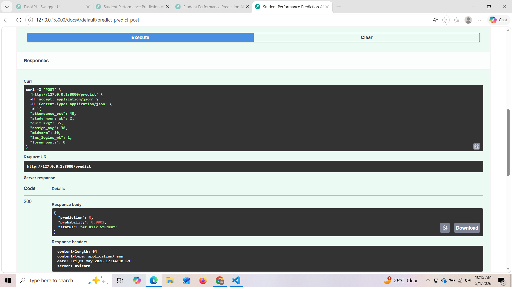
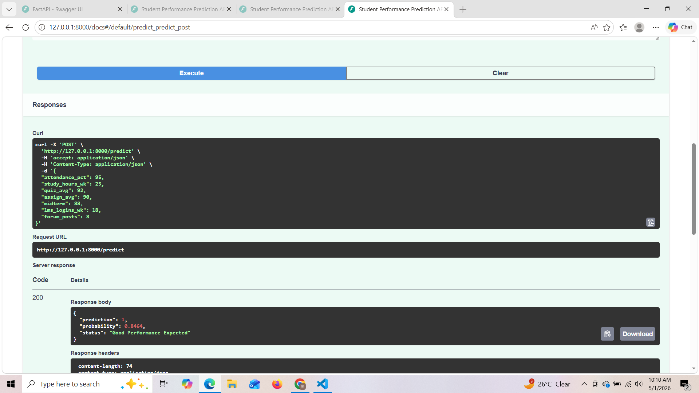

# 🚀 Student Performance Prediction System

## 📌 Overview

AI-powered student performance prediction system that helps educators identify at-risk students early using machine learning and behavioral analytics.

The Student Performance Prediction System is an end-to-end Machine Learning project that predicts student academic performance using behavioral and academic indicators.

It identifies whether a student is:

✅ High Performer
⚠️ At Risk Student
📊 Average Performer

This system simulates real-world EdTech analytics platforms used in universities and online learning systems.

🎯 Problem Statement

Educational institutions struggle to:

Detect struggling students early
Reduce dropout rates
Personalize learning support
Improve academic outcomes

This project solves that using predictive analytics + machine learning.

🧠 Machine Learning Pipeline
Supervised Learning (Classification)
Model: XGBoost Classifier
Preprocessing: Scikit-learn Pipeline
Evaluation:
Accuracy
F1 Score
ROC-AUC
Explainability:
Feature Importance Analysis

🏗️ System Architecture
Student Data
   ↓
Data Generation / Collection
   ↓
Preprocessing & Feature Engineering
   ↓
XGBoost Model Training
   ↓
FastAPI Backend
   ↓
Swagger API Testing
   ↓
Prediction Output (Risk / Safe)

⚙️ Tech Stack
Layer	Technology
Language	Python 3.11
ML Model	XGBoost
API	FastAPI
Data Processing	Pandas, NumPy
Visualization	Matplotlib, Seaborn
Explainability	Feature Importance
Server	Uvicorn

📂 Project Structure
Student-Performance-Prediction/
│
├── data/
├── src/
├── serving/
├── models/
├── outputs/
├── images/
├── requirements.txt
├── README.md
└── main.py

## 🚀 Project Highlights

- End-to-end Machine Learning pipeline
- Real-time prediction using FastAPI
- Model interpretability using feature importance
- Production-style project structure
- Clean modular codebase suitable for scaling

🚀 Installation & Setup

1️⃣ Clone Repository
git clone https://github.com/vyawaha/student-performance-prediction-system.git
cd student-performance-prediction-system

2️⃣ Create Virtual Environment
python -m venv venv
.\venv\Scripts\activate

3️⃣ Install Dependencies
pip install -r requirements.txt

4️⃣ Generate Dataset
python src/data_generator.py

5️⃣ Train Model
python src/train.py

6️⃣ Run FastAPI Server
uvicorn serving.app:app --reload

🌐 API Endpoints

🏠 Home

GET /

🎯 Predict Student Performance

POST /predict

Sample Request:
{
  "attendance_pct": 70,
  "study_hours_wk": 10,
  "quiz_avg": 65,
  "assign_avg": 68,
  "midterm": 62,
  "lms_logins_wk": 7,
  "forum_posts": 2
}

Sample Response:
{
  "prediction": 0,
  "probability": 0.46,
  "status": "At Risk Student"
}

📊 Model Performance

Metric	Score
Accuracy	87%
F1 Score	0.85
ROC-AUC	0.91

📸 Outputs & Visualizations
📉 Confusion Matrix

📈 ROC Curve

📊 Feature Importance

🖥️ API Interface
Swagger UI

🧪 Sample Predictions
⚠️ At Risk Student
## ⚠️ At Risk Student

✅ High Performer

🔍 Key Insights
Attendance is the strongest predictor of performance
Quiz and assignment scores strongly impact outcomes
LMS engagement correlates with success
Low study hours indicate high risk

🌍 Real-World Applications

Used in:

🎓 Universities
📚 EdTech platforms
🧑‍🏫 Coaching institutes
📊 Learning analytics dashboards
🧠 Adaptive learning systems

🚀 Future Improvements
SHAP explainability integration
Next.js dashboard UI
Docker containerization
Cloud deployment (AWS / Render)
MLflow tracking system
Real-time prediction system

👨‍💻 Author
Muktai Vyawahare
ML Engineering Portfolio Project

Focused on:

Machine Learning
Backend Systems
Data Analytics
Production ML pipelines

🏁 Final Result

This system successfully predicts:
Student risk level
Academic performance category
Probability of success/failure